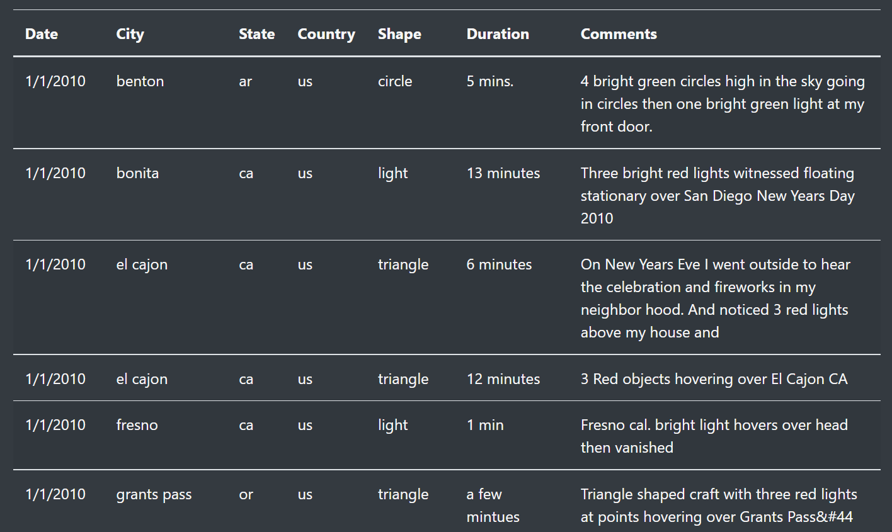
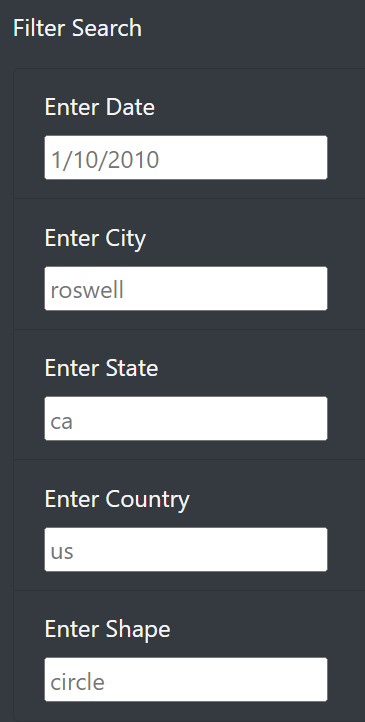
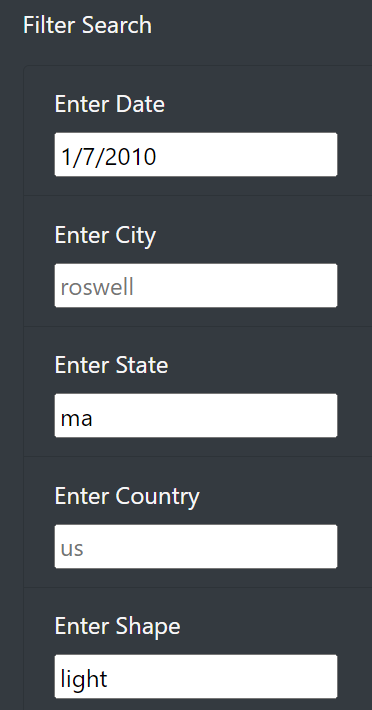

# UFO Sightings: Webpage Creation & Dynamic Table

## Overview
As we connect data analytics with visualization tools, we were provided a large data file for a collection of UFO sightings across the country, and we were also tasked with creating a visual representation that would assist the end user filter and analyze the data given to them. Utilizing data visualization tools like JavaScript, HTML, and CSS, we need to combine these that would allow any user to perform and interact with filters. Essentially, these are all of the foundational tools needed to construct a live and user-friendly site of virtually any webpage.

As our client Dana has this file of data collections of a number of different UFO sightings and elements associated with their sighting, we need to create a site that will allow for easy viewing and react to user input. In turn, this allows for the data to be converted and create a bridge for an interactive connection between users and the data. 

## Results
When we first access the website, our browser takes us straight to viewing the title header and the blurb that provides insight as to what the subject of the website.

Scrolling further, we see the dynamic table that has been established which contains all of the data points (from our data.js file) and their corresponding information regarding UFO sightings throughout the course of years in the United States. With each row corresponding as one data point, scrolling down the site we can see the size of the table and the copious amount of data points.

On the left side of the page, we have created multiple search engines that will allow the end user to narrow down specific UFO sighting events by filtering for certain characteristics. The following filter searches have been created by: Data, City, State, Country, and Shape. These were selected as they were all specific qualifiers that would allow the end user to hone in and obtain one or multiple specific events. Having these filters are a great aid to website users as it makes it more user-friendly, this type of accessibility is key to keeping user satisfaction in mind.  

Using the following example, we are able to see in real time how the filters work in conjugation with narrowing down the data in the table. For example, by setting the following filters:

- Enter Date: 1/7/2010
- Enter State: ma
- Enter Shape: light

We are able to see in action the filter search component of the table generate results and to filter through two pieces of data points from the entire data set that match the criteria entered. Ultimately, from the information the end user edits, it will clearly align with producing an accurate read and return of the table. 

## Summary
While we have created a website that is not only user friendly but allows for a dynamic functionality of data, one specific drawback of this new website design that could be enhanced in a future remodel is the specificity of the data points, meaning how the information in the search bar is entered matters greatly. 

We would need to update the code for the filter searches to allow for multiple methods of the user entering the information, such as no capitalization or having the first letter capitalized or the entire word capitalized. The user will not recognize that the information can only be entered using lower case. We need to appreciate that end users can enter the data in a variety of ways and need to further consider and display this in the code creation of the site. 

For example, as we enter ‘Willow’ in the City filter search field, we have zero results appear when in fact we know that there should be two results for the city of Willow. We need to appreciate that end users can enter the data in a variety of ways and need to further consider and display this in the code creation of the site. 

Another recommendation for further development could be to include a hovering key or symbol right next to each filter field to provide the user options as to how to enter the data so the search produces the results they seek. This will allow the user to be aware as to how to enter the data before they do so in the search field. Guides like these go a step beyond to truly assist and make the user experience more pleasant. 
